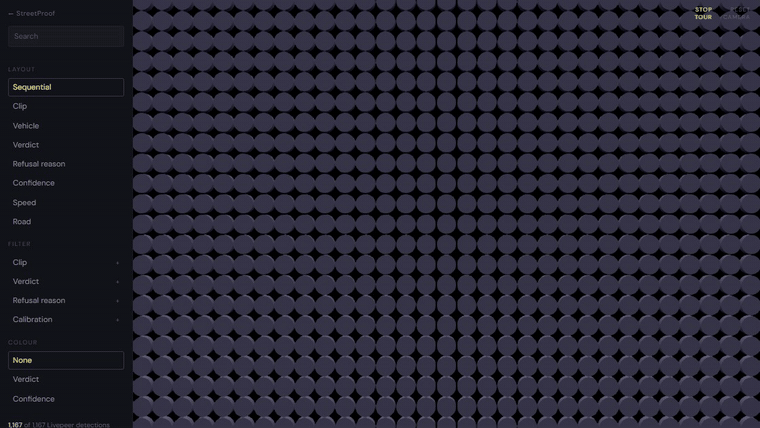
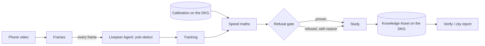

# StreetProof

**A neighbourhood speed study you can check.** Film your street. StreetProof measures every car it can prove, refuses the ones it can't (and says why), and publishes the result to the OriginTrail Decentralized Knowledge Graph with the video's fingerprint, so a city, a neighbour or a journalist can check the numbers came from that exact video.

**Livepeer Agent Hackathon, Track 2: Livepeer Agent + OriginTrail DKG.** Demo video: _link in the submission_.




## The problem

People who live on a fast street usually know it, but "they drive too fast" doesn't move a city. In Toronto, for example, a traffic calming request starts with the local Councillor, and the City then collects its own speed data. Speed humps are warranted on a local road (a block of at least 120 m) when the 85th percentile speed is over 38 km/h or the 95th percentile is over 45 km/h, and **a request found not warranted puts the street under a three-year moratorium on new data collection** ([Toronto 2023 Traffic Calming Policy](https://www.toronto.ca/legdocs/mmis/2023/ie/bgrd/backgroundfile-239912.pdf)). So residents need a trustworthy first look before they ask. A phone video usually gets dismissed, because nobody can tell how the numbers were made or whether the video was edited.

StreetProof turns a video into the numbers cities use, the 85th and 95th percentile speeds, with every step recorded and checkable.

## What it does

1. **Detect.** Every frame (15 per second) goes to Livepeer's `yolo-detect` through the Livepeer Agent. It returns a box for each vehicle.
2. **Track.** Overlapping duplicate boxes (one car boxed as both "car" and "truck") are merged, and boxes are linked frame to frame into one track per vehicle.
3. **Measure.** Side-on footage uses a known distance on the road. Head-on footage uses how fast a vehicle's box grows: when a car drives towards the camera, 1 / (box height) rises in a straight line, and the slope of that line times the camera's focal length times the car's height is its speed.
4. **Refuse.** A fixed set of rules decides whether each vehicle's evidence supports a speed: enough clean frames, a steady straight-line fit, a stable box, a confident detection, a plausible speed. If not, the vehicle is **refused**, with the reason. Refused vehicles never enter the percentiles.
5. **Publish.** The study (video fingerprint, method, thresholds, every vehicle's result, the calibration it used) becomes a Knowledge Asset on the DKG.
6. **Verify.** Anyone with the video and the study's locator can hash the video in their browser and compare it with the fingerprint read from the DKG. A single changed byte gives `MISMATCH`.
7. **Report.** A printable one-page report for the city: the finding, the 85th and 95th percentiles against Toronto's warrant as an example, the histogram, refusals, method, how to verify, and limits.



## The app

Every screen reads the live API. There is no demo or fixture mode. Open http://localhost:8080 once the app is running.

- **New study:** one-click VS13 test clips, or upload your own video. Calibrate by clicking two road marks a known distance apart on the real first frame, a typical car length, a calibration loaded from the DKG (same camera only), or none to see what gets refused.
- **Processing:** live status from the server: frames through Livepeer, calls made, and whether cached detections were reused.
- **Results:** the annotated video (green proven, red refused with the reason), a check against Toronto's warrant, a gate ledger showing where each vehicle stopped, every vehicle with its crop, the speed histogram, **Publish to the DKG**, and the report for the city.
- **Verify:** your browser computes the video's SHA-256. Only the fingerprint goes to the server, which reads the published fingerprint from the DKG by the study's locator. A "one byte changed" button shows a tampered copy failing.
- **Accuracy:** the held-out test, the cross-validation over every choice of calibration clips, and every calibration on the DKG with its passes.
- **Every detection in 3D:** each disc is one Livepeer `yolo-detect` box in one frame. Eight layouts animate between each other, with filters, search, a tour mode (key T), and a click-a-disc card with the car and its DKG records. The look follows Peter Beshai's Cortico demo ([article](https://medium.com/cortico/3d-data-visualization-with-react-and-three-js-7272fb6de432), [MIT source](https://github.com/CorticoAI/3d-react-demo)), written from scratch in plain three.js.

## How Livepeer is used

Livepeer is how StreetProof sees. Remove it and there is no measurement.

- **`yolo-detect` on every frame.** Each frame is sent with `upload`, then `run_capability` with `yolo-detect` (two calls per frame; a 10 second clip at 15 frames per second is 150 frames). The detections come back as a JSON sidecar, which is parsed into vehicle boxes.
- **`nemotron-omni-vision` footage check.** The middle frame is asked whether the road and vehicles are clearly visible (enough light, no heavy rain, snow, fog, glare or blocked view). A NO refuses every vehicle in the study with `POOR_CONDITIONS`; it can never add a speed. It is on for the one-click clips and on by default for uploads, and off in the accuracy script so the accuracy numbers don't depend on it.
- **Robustness.** Every frame's detections are cached by video fingerprint and frame rate, so a run resumes where it stopped and re-running a clip costs no calls. Rate limits (`429`, `retry_after_seconds`) are waited out, up to 4 retries per frame.
- **Cost.** The app estimates $0.001 per detection. The runs here used the Livepeer Agent's keyless demo credit.

## How the DKG is used, and why it matters

Two features only work because of it.

**1. Calibration memory.** Turning pixels into speed needs a calibration for each camera. StreetProof learns it from cars driving past at known speeds, publishes it as a Knowledge Asset, and later studies from that camera **load it back from the DKG** (a SPARQL query to the node for the asset's graph) and cite it. A calibration is built from several passes: the focal length is the **median** of the passes, and if one pass disagrees with the median by more than 15% the calibration itself is refused. Each pass video is published as its own Knowledge Asset and the calibration cites them, so anyone can see which drives a calibration came from and how much they agreed.

**2. Tamper check.** A study's Knowledge Asset holds the SHA-256 fingerprint of the exact video it measured. The verifier reads that fingerprint from the DKG and compares.

What a published study holds (real query output, abridged):

```
https://schema.org/sha256                   aa50a29dafd94441db6a25591ad1a9fcf3220f9d7c36838b4b01a6bcf1943389
https://streetproof.dev/ns#calibratedWith   did:dkg:context-graph:0x5Ea0.../streetproof/_working_memory/0x5ea0.../15
https://streetproof.dev/ns#calibrationMode  APPROACH
https://streetproof.dev/ns#detector         livepeer:yolo-detect
https://streetproof.dev/ns#minRSquared      0.95
https://streetproof.dev/ns#v85Kmh           80
```

**Where it runs, on-chain.** An edge node on the **DKG V10 Base Sepolia testnet**, context graph `streetproof`, **registered on-chain** as context graph 488 ([registration tx](https://sepolia.basescan.org/tx/0x1d465dabd6b451cf9fc5a2b6c9892aaead2cc889e6ac787f9736ea272699cddc)). Two Knowledge Assets are published to **Verifiable Memory**, each acknowledged by three OriginTrail core nodes:

| Asset | UAL | Transaction |
|---|---|---|
| The 3-pass calibration used by every study above | `did:dkg:base:84532/0x5ea07ffddc58dd261102746e6651747e18429dbe/15` | [0xbabe6c6d…cad8](https://sepolia.basescan.org/tx/0xbabe6c6dbfecdb8066ec3e7ce4411d16840cdeed81eb058ccc4dd999a1eccad8), block 47243284 |
| A published study (Renault Captur: 3 tracked, 1 proven, 2 refused) | `did:dkg:base:84532/0x5ea07ffddc58dd261102746e6651747e18429dbe/16` | [0x6f722e8f…2825](https://sepolia.basescan.org/tx/0x6f722e8f31beae015188695ad03450273098713ffb5fc66be5e205cd6f652825), block 47243591 |

The app's **Publish to the DKG** button writes to **Shared Working Memory** (`dkg ka create ... --share`), which is instant and needs no gas. Moving an asset to Verifiable Memory is `dkg ka publish <asset> -c <context graph>`; it needs a little testnet ETH and storage acknowledgements from 3 core nodes, which on Sep 24 took several retries because one core node ran an incompatible protocol version. A `local` mode (`STREETPROOF_DKG_MODE=local`) writes the same Turtle to disk for development; **every result in this README came from the real node, not local mode.**

### What lives where

| Data | Where it goes |
|---|---|
| The video and its frames | Stays on the StreetProof server (the resident's machine) |
| Every frame | Sent to Livepeer for `yolo-detect` (frames can show faces and plates; StreetProof does not blur them yet) |
| One frame per study | Sent to Livepeer's `nemotron-omni-vision` when the footage check is on |
| Detection cache, study state | Local disk only |
| Video fingerprint, method, thresholds, per-vehicle results, calibration link | Published as a Knowledge Asset: Shared Working Memory on the testnet node, and for the calibration and one study, Verifiable Memory on Base Sepolia |
| DKG node keys (`~/.dkg`) | Local only, never committed |

## Does it measure correctly?

We tested on the sample clips of [VS13](https://slobodan.ucg.ac.me/science/vs13/) ([paper](https://arxiv.org/abs/2212.01651)), a public benchmark from the University of Montenegro: 13 cars filmed head-on, each held at a known speed by cruise control. We used 12 (the Mercedes AMG 550's exact model and height are unclear). Vehicle heights come from manufacturer spec sheets.

**Calibration:** three passes, the first three clips by filename (Citroen, Kia, Mazda 3), published to the DKG. The passes agreed within 9.7%.

**Held-out test: the other 9 clips, never used for calibration.**

| Clip | Known km/h | Measured km/h | Error |
|---|---|---|---|
| Mercedes GLA | 88 | 87.9 | -0.1% |
| Nissan Qashqai | 82 | 87.8 | +7.1% |
| Opel Insignia | 70 | 73.6 | +5.1% |
| Peugeot 208 | 79 | 81.1 | +2.7% |
| Peugeot 3008 | 83 | 80.0 | -3.6% |
| Peugeot 307 | 82 | 87.2 | +6.3% |
| Renault Captur | 66 | 61.6 | -6.7% |
| Renault Scenic | 80 | 84.6 | +5.7% |
| VW Passat | 85 | 87.8 | +3.3% |

**9 of 9 proven, mean error 4.5%, worst 7.1%.** On a real street the car's height isn't known, so the app assumes 1.5 m. With every test car assumed to be 1.5 m tall, the same clips give **5.4% mean, worst 11.6%**. For comparison, [Telraam](https://faq.telraam.net/en/article/14/speed-measurement-v85-explained), a citizen traffic-counting sensor, says its speed measurements may differ from real speeds by about 10%.

**Why three passes.** Measured speed is proportional to the focal length, so we can re-score every possible choice of calibration clips without re-running detection. Calibrating on one clip averages 5.9% error across the 12 choices, but the worst choice (the Kia alone, which is what our first attempt used) gives 11.1% mean and 16.8% worst. Two or three passes average 5.1%, and the median protects against one bad pass.

**A bug we found and fixed.** YOLO sometimes boxed one car as both "car" and "truck", and the tracker counted it twice. Overlapping boxes are now merged before tracking, and every number above was re-run from scratch after the fix, including the calibration.

Reproduce it: put the VS13 sample clips in `samples/` (see below), start the app and the DKG node, then run `python scripts/reproduce_validation.py`. The live numbers are at `GET /api/validation`.

## Limits, honestly

- **Not radar.** This is evidence for asking a city for a formal study, not a basis for a ticket.
- **Small samples.** Spot speed studies usually use at least 50 vehicles, preferably 100 ([ASU POP Center guide](https://popcenter.asu.edu/sites/default/files/learning/speeding/SpotSpeed.pdf)). A short clip gives fewer, and the report says so.
- **The gate cannot catch a bad calibration.** It refuses shaky measurements, but a calibration that is off shifts every speed by the same factor. Multi-pass calibration and its 15% agreement rule are the answer, not a guarantee, and a calibration belongs to one camera in one position.
- **Head-on speeds depend on the vehicle's height.** A car 10% taller than assumed reads about 10% slow. Every vehicle in one study gets the same assumed height.
- **The validation is head-on, one car per clip, at highway speeds.** Side-on measurement (curb marks or typical car length) is built and unit-tested but has not been checked against known speeds.
- **Most studies stay in Shared Working Memory.** The calibration and one study are in Verifiable Memory on-chain; the rest are in Shared Working Memory on our testnet node, because moving each one on-chain takes gas and several minutes of network acknowledgements (see above).
- **No blurring yet.** Frames go to Livepeer as they are; blurring faces and plates before sending is the next privacy step.

## Prior art

- **[Telraam](https://telraam.net/en/what-is-telraam)**: a window-mounted sensor that counts road users and estimates speeds, with residents sharing data with their city. Hardware, no per-vehicle refusal, no checkable record of the video.
- **[Roboflow supervision speed estimation](https://blog.roboflow.com/estimate-speed-computer-vision/)**: open-source detection, tracking and perspective transform for vehicle speed. A developer tutorial, without a refusal step or a published record.

StreetProof's difference is the refusal gate, the calibration memory on the DKG, and the tamper check.

## Run it

Needs Java 25, ffmpeg, Python 3 with curl (for the reproduce script), and Node 22.13 or newer for the DKG node. Tested on Windows 10.

1. **DKG node** (once):
   ```
   npm install -g @origintrail-official/dkg
   dkg init --role edge --network testnet
   dkg start
   dkg status
   ```
   Pick the testnet: the default network is mainnet. On Node 25 the install script of `better-sqlite3` can crash; install with `--ignore-scripts`, then run `npx prebuild-install` inside `node_modules/@origintrail-official/dkg/node_modules/better-sqlite3` to fetch its official prebuilt binary. Run `dkg start` again after a reboot. Never commit `~/.dkg` (it holds the node's wallet keys). No node? Set `STREETPROOF_DKG_MODE=local`.
2. **App:** ffmpeg must be on your PATH, or set `FFMPEG_PATH` to the ffmpeg executable. Then `./mvnw spring-boot:run` (port 8080). `LIVEPEER_API_KEY` is optional; without it the Livepeer Agent's keyless demo credit is used. `GET /api/health` shows what is connected.
3. **Sample clips:** download the VS13 sample clips from the dataset page into `samples/`, named like `vs13-KiaSportage_72.mp4`. They are not in this repo: the dataset page states no licence, so we don't redistribute them.
4. **Accuracy test:** `python scripts/reproduce_validation.py` (set `STREETPROOF_URL` if the app isn't on port 8080). It learns the calibration, publishes it, and measures the held-out clips. Run it before using the one-click sample presets, which reference that calibration.
5. **Open it:** http://localhost:8080. The built frontend in `frontend/dist` is served by the app itself. To work on the frontend: `cd frontend`, `npm install`, `npm run dev` (Vite on port 5173, proxying `/api` to port 8080).
6. **API:** see [docs/API.md](docs/API.md). City report: `GET /api/studies/{id}/report`.

Studies are saved to disk (`~/streetproof-data/studies/*/state.json`) and reload after a restart. Tests: `./mvnw test`.

## Credits

- 3D view design after Peter Beshai's [Cortico demo](https://github.com/CorticoAI/3d-react-demo) (MIT).
- The landing page's `DotField` and `GridDistortion` effects are adapted from [React Bits](https://reactbits.dev).
- The landing page background image (`frontend/public/street_bg.jpg`) is AI-generated (Google), per its embedded metadata.
- Accuracy data: the VS13 dataset (Djukanovic et al., University of Montenegro).

## Team

- **Sidharth Nair**: backend (Java, Spring Boot), speed maths, refusal gate, Livepeer and DKG integration, the 3D detection view, and wiring the screens to the API.
- **Basudev Biju**: frontend design and screens.

## License

[MIT](LICENSE) © 2026 Sidharth Nair and Basudev Biju
