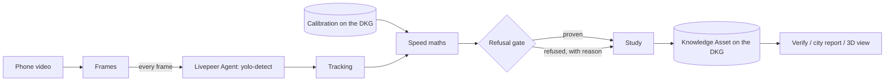

# StreetProof

**A neighbourhood speed study you can verify.** Film your street with a phone. StreetProof measures every car it can measure properly, refuses the ones it can't (and says why), and publishes the result to the OriginTrail Decentralized Knowledge Graph so the city, a neighbour or a journalist can check it without trusting you or us.

Built for the Livepeer Agent Hackathon, Track 2 (Livepeer Agent + OriginTrail DKG).


## The problem

People who live on a street where cars fly past usually know it, but "they drive too fast" doesn't move a city. A formal speed study needs radar or road tubes and a request queue. Phone videos get dismissed because nobody can tell how the numbers were made or whether the video was edited.

StreetProof turns a video into the same headline number traffic engineers use, the **85th percentile speed** (the speed 85% of drivers stay at or under), with every step recorded and checkable.

## What it does

1. **Detect.** Every frame (15 per second) goes to Livepeer's `yolo-detect` capability through the Livepeer Agent. It returns a box for each vehicle.
2. **Track.** Boxes are linked frame to frame into one track per vehicle.
3. **Measure.** Side-on footage uses a known distance on the road. Head-on footage uses how fast a vehicle's box grows: when a car drives towards the camera, 1 / (box height) rises in a straight line, and the slope of that line times the camera's focal length times the car's height is its speed.
4. **Refuse.** A fixed set of rules decides whether each vehicle's evidence supports a speed: enough clean frames, a steady straight-line fit, a stable box, a confident detection, a plausible speed. If not, the vehicle is **refused**, with the reason. Refused vehicles are never averaged in.
5. **Publish.** The study (video fingerprint, method, thresholds, every vehicle's result) becomes a Knowledge Asset on the DKG.
6. **Verify.** Anyone with the video can check it against the published fingerprint. One changed byte gives `MISMATCH`.
7. **Report.** A printable one-page report for the city: finding, 85th percentile vs the limit, histogram, refusals, method, how to verify, and limits.



## How Livepeer is used

The Livepeer Agent is the eyes of the product. Remove it and there is no measurement.

- `upload` then `run_capability` with `yolo-detect` on **every frame** (one detection per frame, 150 for a 10 second clip at 15 frames per second). The detections come back as a JSON sidecar, which is parsed into vehicle boxes.
- Optional conditions check with `nemotron-omni-vision` on the first frame ("too dark, rainy, blocked or glare?"). It can only add a refusal, never a speed. It was off for the accuracy runs below.
- Rate limits (`429`, `retry_after_seconds`) are waited out, and every frame's detections are cached by video fingerprint, so a run resumes where it stopped and re-running a clip costs no calls.
- The accuracy runs below used the keyless demo credit of the Livepeer Agent: about 1,950 frames across 13 clips.

## How the DKG is used, and why it matters

The DKG is not a place we dump results at the end. Two features only work because of it.

**1. Calibration memory.** Turning pixels into speed needs a calibration for each camera. StreetProof learns it once from cars driving past at a known speed, publishes it as a Knowledge Asset, and every later study from that camera **loads it back from the DKG** (a SPARQL query to the node, not a local file) and cites it. A calibration can be built from several passes: the focal length is the **median** of the passes, and if one pass disagrees with the others by more than 15% the calibration itself is refused. Each pass video is published as its own Knowledge Asset and the calibration cites them, so anyone can see exactly which drives a calibration came from and how much they agreed.

**2. Tamper check.** A study's Knowledge Asset holds the SHA-256 fingerprint of the exact video it measured. The verifier recomputes the fingerprint of any video and queries the node for the published one.

A published study looks like this on the DKG (real query output, abridged):

```
https://schema.org/sha256                   aa50a29dafd94441db6a25591ad1a9fcf3220f9d7c36838b4b01a6bcf1943389
https://streetproof.dev/ns#calibratedWith   did:dkg:context-graph:0x5Ea0.../streetproof/_working_memory/0x5ea0.../7
https://streetproof.dev/ns#calibrationMode  APPROACH
https://streetproof.dev/ns#detector         livepeer:yolo-detect
https://streetproof.dev/ns#minRSquared      0.95
https://streetproof.dev/ns#v85Kmh           81.8
```

Where it runs: an edge node on the **DKG V10 Base testnet**, context graph `streetproof`. Assets are written to **Shared Working Memory** (`dkg ka create ... --share`), which needs no gas. They are **not yet registered on-chain** as Verifiable Memory; that needs testnet ETH for gas, and the faucet did not give us any. There is also a `local` mode (`STREETPROOF_DKG_MODE=local`) that writes the same Turtle to disk for development. **Every result in this README came from the real node, not local mode.**

## Does it measure correctly?

We tested on the sample clips of [VS13](https://slobodan.ucg.ac.me/science/vs13/) ([paper](https://arxiv.org/abs/2212.01651)), a public benchmark from the University of Montenegro: 13 cars filmed head-on, each held at a known speed by cruise control. We used 12 (the Mercedes AMG 550's exact model and height are unclear). Vehicle heights come from manufacturer spec sheets.

**Experiment 1: calibrate on one clip (the Kia), test on 11 unseen clips.**

| | Result |
|---|---|
| Proven | 11 of 11 |
| Mean error | 11.2% |
| Worst | 17.0% |

Every clip read too fast. That pattern is a biased calibration, not random noise.

**Cross-validation.** Measured speed is proportional to the focal length, so we can re-score every possible choice of calibration clip without re-running detection. The Kia turned out to be the **worst of the 12 possible calibration clips**. A typical single clip gives about 5.5% mean error. That is why multi-pass calibration exists.

**Experiment 2: calibrate on three passes, test on 9 unseen clips.** The three passes are the first three clips by filename (Citroen, Kia, Mazda 3). That set includes the bad Kia, and its result is slightly worse than the average over all 220 possible three-clip sets (see below), so it is not a flattering pick.

| Clip | Known km/h | Measured km/h | Error |
|---|---|---|---|
| Mercedes GLA | 88 | 89.9 | +2.2% |
| Nissan Qashqai | 82 | 89.7 | +9.4% |
| Opel Insignia | 70 | 75.2 | +7.4% |
| Peugeot 208 | 79 | 82.9 | +4.9% |
| Peugeot 3008 | 83 | 81.8 | -1.4% |
| Peugeot 307 | 82 | 89.1 | +8.7% |
| Renault Captur | 66 | 67.8 | +2.7% |
| Renault Scenic | 80 | 86.5 | +8.1% |
| VW Passat | 85 | 84.2 | -0.9% |

**9 of 9 proven, mean error 5.1%, worst 9.4%.** The three passes agreed within 9.7%. For comparison, [Telraam](https://faq.telraam.net/en/article/14/speed-measurement-v85-explained), a citizen traffic-counting sensor, says its speed measurements may differ from real speeds by about 10%.

Across every possible choice of calibration clips (median of passes): 1 pass averages 5.5% (worst choice 11.1%), 2 passes 4.8% (worst 8.9%), 3 passes 4.8% (worst 6.8%). More passes mostly protect you from one bad pass.

Reproduce it: put the VS13 sample clips in `samples/` (see below), start the app and the DKG node, then run `python scripts/reproduce_validation.py`. The live numbers are at `GET /api/validation`.

## Limits, honestly

- **Not radar.** This is evidence for asking a city for a formal study, not a basis for a ticket.
- **The gate cannot catch a bad calibration.** It refuses shaky measurements, but in experiment 1 speeds 17% off still came out "proven" because the calibration itself was off. Multi-pass calibration and its 15% agreement rule are our answer, not a guarantee.
- **Head-on speeds depend on the vehicle's height.** We used spec-sheet heights for the test cars (the Passat is assumed to be the sedan). On a real street the height is a typical value (1.5 m by default), so a car 10% taller than assumed reads about 10% slow. Every vehicle in one study currently gets the same assumed height.
- **The validation is head-on, one car per clip, at highway speeds.** Side-on measurement (curb marks or typical car length) is built and unit-tested but has not been checked against known speeds.
- **Studies live in memory.** A server restart clears them (the detection cache and the DKG records survive; `scripts/reproduce_validation.py` rebuilds the accuracy studies in about 3 minutes).
- **Not on-chain yet.** Knowledge Assets are in Shared Working Memory on testnet, not registered as Verifiable Memory (see above).

## Prior art

- **[Telraam](https://telraam.net/en/what-is-telraam)**: a window-mounted sensor that counts road users and estimates speeds, with residents sharing data with their city. Hardware, no per-vehicle refusal, no verifiable record of the video.
- **[Roboflow supervision speed estimation](https://blog.roboflow.com/estimate-speed-computer-vision/)**: open-source detection, tracking and perspective transform for vehicle speed. A developer tutorial, not a product that refuses bad evidence or publishes a checkable record.

StreetProof's difference is the refusal gate, the calibration memory on the DKG, and the tamper check.

## Run it

Needs Java 25, ffmpeg, and Node 22.13 or newer for the DKG node.

1. **DKG node** (once; choose an edge node on testnet when `dkg init` asks):
   ```
   npm install -g @origintrail-official/dkg
   dkg init
   dkg start
   ```
   On Node 25 the install script of `better-sqlite3` can crash; install with `--ignore-scripts`, then run `npx prebuild-install` inside `node_modules/@origintrail-official/dkg/node_modules/better-sqlite3` to fetch its official prebuilt binary. Never commit `~/.dkg` (it holds the node's wallet keys).
2. **App:** set `streetproof.ffmpeg-path` in `src/main/resources/application.properties`, then `./mvnw spring-boot:run` (port 8080). `LIVEPEER_API_KEY` is optional; without it the Livepeer Agent's keyless demo credit is used. `GET /api/health` shows what is connected.
3. **Sample clips:** download the VS13 sample clips from the dataset page into `samples/`, named like `vs13-KiaSportage_72.mp4`. They are not in this repo: the dataset page states no licence, so we don't redistribute them. The `.json` presets next to them make `POST /api/samples/{name}/study` a one-click run.
4. **API:** see [docs/API.md](docs/API.md). City report: `GET /api/studies/{id}/report`.

Tests: `./mvnw test`.

## Team

- **Sidharth Nair**: backend (Java, Spring Boot), speed maths, refusal gate, Livepeer and DKG integration.
- **Basudev Biju**: frontend, including the 3D view.

## License

[MIT](LICENSE) © 2026 Sidharth Nair and Basudev Biju
